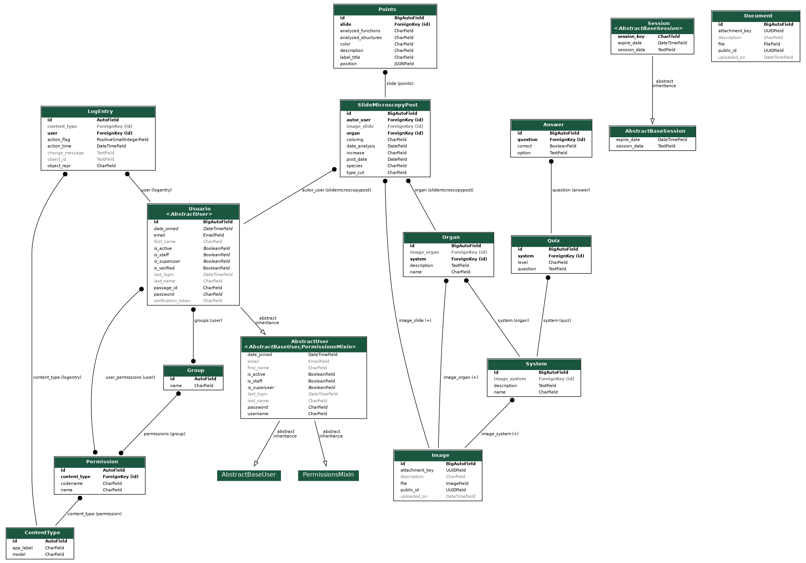

# Projeto Fábrica Histologia, Repositorio: Backend.

## Para rodar o sistema é necessário fazer as seguintes etapas:

- Instalar o RabbitMQ no seu computador, para sistemas derivados do Debian de o seguinte comando:
  
```powershell
sudo apt-get update
sudo apt-get install rabbitmq-server
```
- Rodar o servidor RabbitMQ:
  
```powershell
sudo systemctl start rabbitmq-server
sudo systemctl enable rabbitmq-server
```
  - Criar o vhost:
    
```powershell
  sudo rabbitmqctl add_vhost fabricahistologia
```

- De permissão ao seu usuario no vhost:

```powershell
  sudo rabbitmqctl set_permissions -p fabricahistologia SEUUSUARIO ".*" ".*" ".*"
```


## Para rodar o RabbitMQ e o Celery: 

```powershell
export PYTHONPATH=$(pwd)/src
```

```powershell
 pdm run celery -A django_project worker --loglevel=info
```

- Acessar o Painel de controle do flower:
- 
```powershell
  pdm run python -m celery -A django_project flower
```

## Fluxograma de dados:



## Caso de uso do projeto:


## Fluxograma: 

### Fluxograma - visitante:


### Fluxograma - Authenticação ao Painel:


### Fluxograma - Gerenciamento de Laminas:


### Fluxograma - Gerenciamento dos Materiais de Apoio:


## Fluxograma - Gerenciamento do Quiz:


